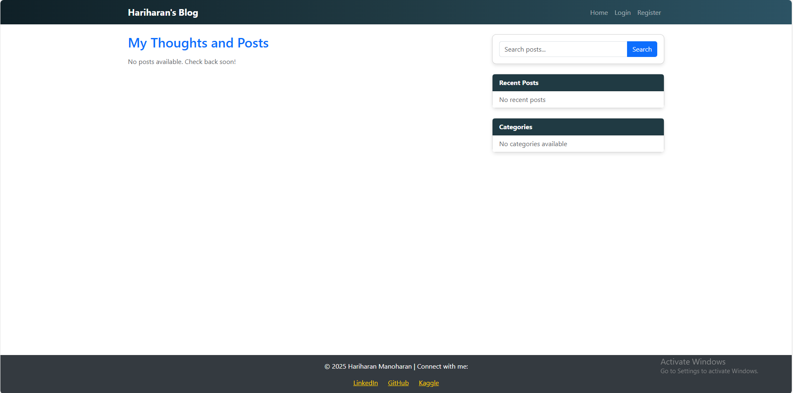

# Personal Blog

This is a personal blog project built with Django. It allows users to create, edit, and delete blog posts. Users can also comment on posts and view posts by category.

## Features

- User authentication (signup, login, logout)
- Create, edit, and delete blog posts
- Comment on posts
- View posts by category
- Responsive design

## Installation

1. Clone the repository:
    ```bash
    git clone https://github.com/yourusername/personal_blog.git
    ```
2. Navigate to the project directory:
    ```bash
    cd personal_blog
    ```
3. Create a virtual environment:
    ```bash
    python -m venv venv
    ```
4. Activate the virtual environment:
    - On Windows:
        ```bash
        venv\Scripts\activate
        ```
    - On macOS/Linux:
        ```bash
        source venv/bin/activate
        ```
5. Install the required packages:
    ```bash
    pip install -r requirements.txt
    ```
6. Apply migrations:
    ```bash
    python manage.py migrate
    ```
7. Create a superuser:
    ```bash
    python manage.py createsuperuser
    ```
8. Run the development server:
    ```bash
    python manage.py runserver
    ```

## Usage

- Access the blog at `http://127.0.0.1:8000/`
- Log in with your superuser account to create, edit, or delete posts
- Register a new account to comment on posts

## Contributing

Contributions are welcome! Please fork the repository and create a pull request with your changes.

## License

This project is licensed under the MIT License. See the [LICENSE](LICENSE) file for details.

## Contact

For any questions or suggestions, please contact [your email address].

## Screenshot

